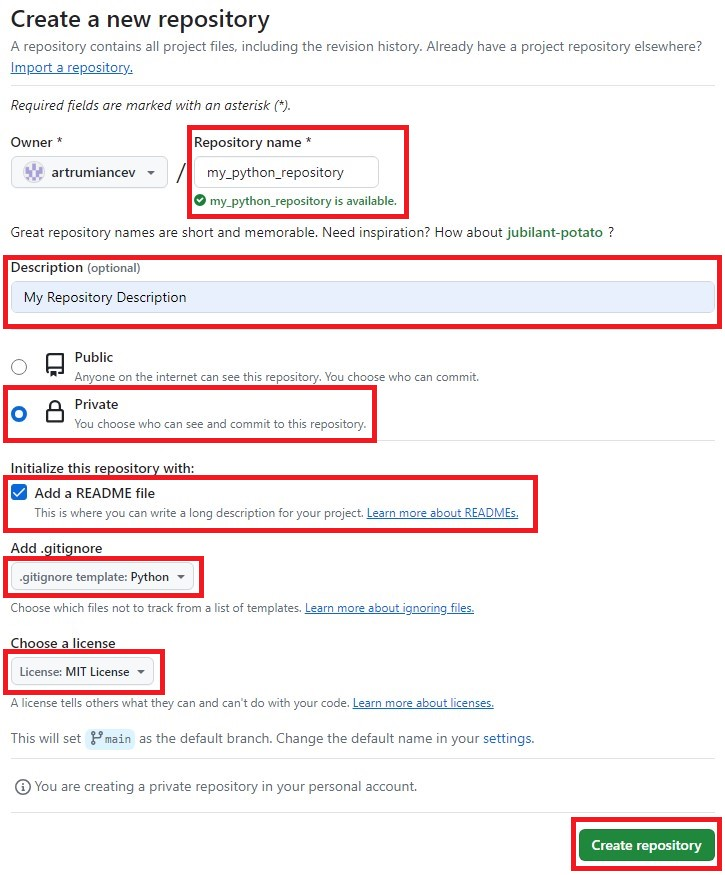
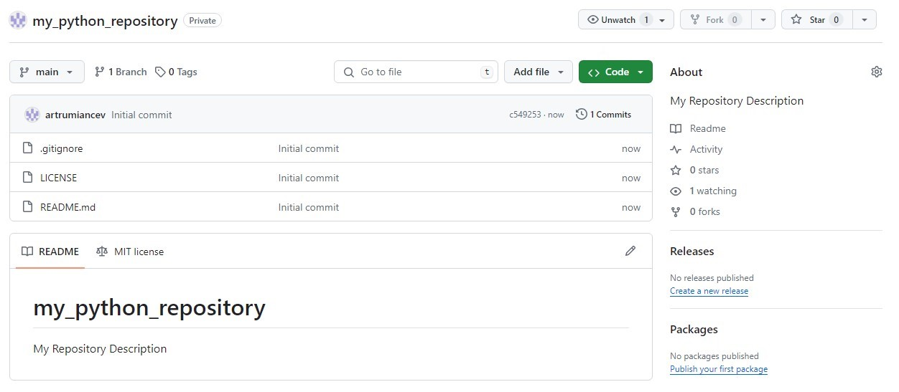
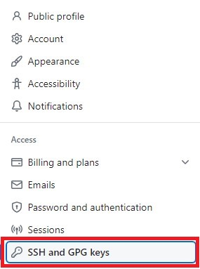
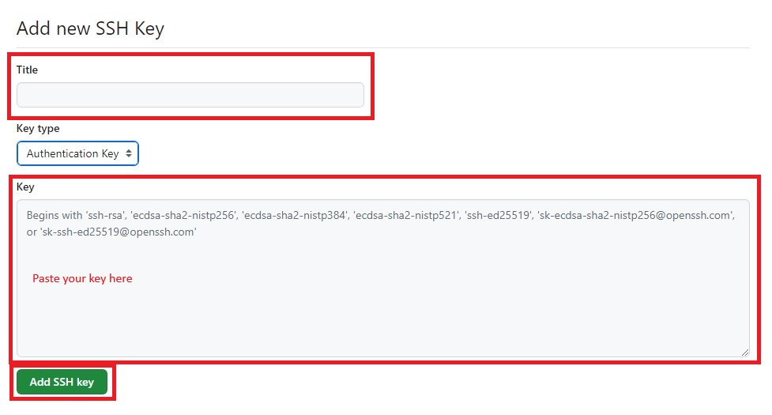
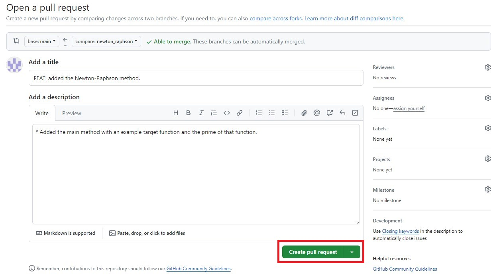
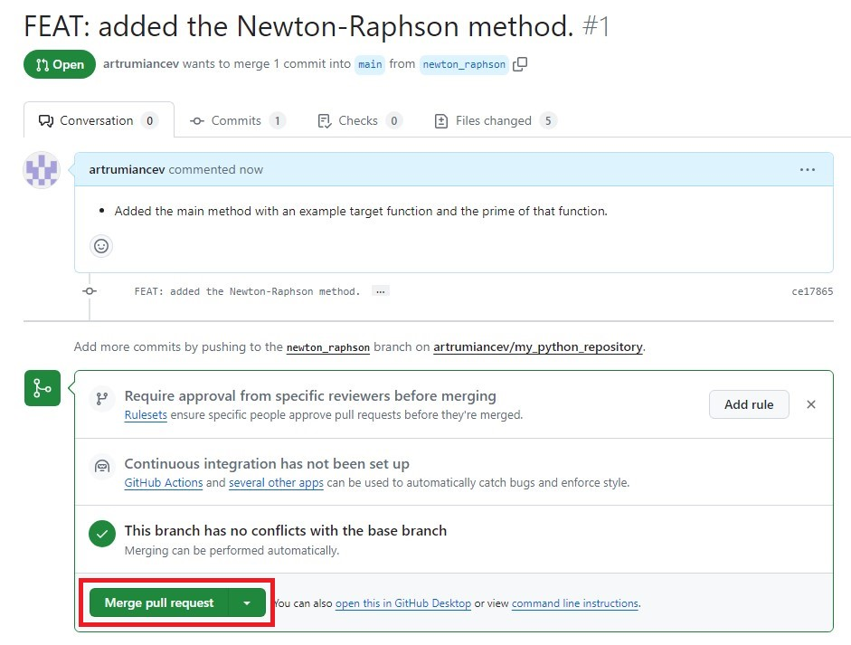

# Networking and training sessions with UCL: Introduction to GitHub - Python
- [Networking and training sessions with UCL: Introduction to GitHub - Python](#networking-and-training-sessions-with-ucl-introduction-to-github---python)
  - [Setup](#setup)
  - [Creating a GitHub Repository](#creating-a-github-repository)
  - [Working on the Repository (locally)](#working-on-the-repository-locally)
  - [Creating a Python Project](#creating-a-python-project)
  - [Pushing the Changes to GitHub](#pushing-the-changes-to-github)
  - [Additional Notes: Packaging the Python Project](#additional-notes-packaging-the-python-project)
  - [Additional Notes: Publishing the Python Project to PyPI](#additional-notes-publishing-the-python-project-to-pypi)

## Setup
**NOTE:** This tutorial uses `Windows PowerShell` commands. As such, the commands may differ for e.g. Linux/MacOS.
1.	Download and install **[Git](https://git-scm.com/downloads)**.

In the current demo, we will be using `Windows 10`, so you would need to select the version corresponding to your OS. To check that Git is installed and added to `$PATH` use:
```powershell
git --version
```
The output should look similar to:
```powershell
git version 2.35.0.windows.1
```
We also need to set a name and email for authorship:
```powershell
git config --global user.name "Your Name"
git config --global user.email "your_email@example.com"
```
2.	Download and install **[Python](https://www.python.org/downloads/)** `3.11` or `3.12`. 

In this demo we will be using Python 3.11. Make sure that Python is added to `$PATH`. To check this, we can open type:
```powershell
python --version
```
The output should be similar to:
```powershell
Python 3.11.2
```
3. Download and install **[Visual Studio Code (VSCode)](https://code.visualstudio.com/download)** or any other Python editor (VSCode will be used in this tutorial).

Once VSCode is installed sucessfully and PowerShell is reloaded, you should be able to launch VSCode from console as:

```powershell
code .
```
**Note on Python package management**

Given that Python packages are updated regularly and new Python versions come out annually, it is recommended to use a package manager and a virtual environment for Python projects. These will help organise your projects and determine the appropriate versions of external packages that you add to them.

For this tutorial, we will be using `Poetry`, which is a package manager and supports multiple virtual environments.

4. Download and install **[Poetry](https://python-poetry.org/docs/#installing-with-the-official-installer)**.

On Windows, we can install Poetry as:
```powershell
(Invoke-WebRequest -Uri https://install.python-poetry.org -UseBasicParsing).Content | py -
```
We can check that Poetry has been succesfully installed by using:
```powershell
poetry --version
```
Which should print something similar in the console:
```powershell
Poetry (version 1.2.1)
```
## Creating a GitHub Repository
1. Create a repository.

Go to your GitHub account and open the `Repositories` tab in your account:


Navigate to top right of the screen and click on `New`:


In the next window, you can name, add a description and control the initialization of your repository and click on `Create repository`:



**NOTE:** Here, you might consider setting the repository to `Private` (which can be changed in settings later on) while you are working on a reliable version of the code. Once you have created your repository on GitHub:


It should look something like:



To be able to work on this repository remotely, you need to clone it and set up a git conncetion. The simple way to do this is through `HTTPS`:


At this point you should be able to clone the repository and start working on your Python project remotely. However, it is highly recommended to use an SSH connection as it is a much more secure option

2. Setting up SSH conncetion (Optional)

In order to set-up an SSH conection, you need to generate an SSH key. GitHub's
**[Generating a new SSH key and adding it to the ssh-agent](https://docs.github.com/en/authentication/connecting-to-github-with-ssh/generating-a-new-ssh-key-and-adding-it-to-the-ssh-agent)** and **[Adding a new SSH key to your GitHub account](https://docs.github.com/en/authentication/connecting-to-github-with-ssh/adding-a-new-ssh-key-to-your-github-account)** provide a detailed explanation of how to do this. In general, for `Windows` you can genetare an SSH key as:
```powershell
ssh-keygen -t ed25519 -C "your_email@example.com"
```
which will prompt you to create a password (best to write it down, as you will have to generate a new SSH key if you forget it). Once you have generated the SSH key, you can use:
```powershell
cat ~/.ssh/id_ed25519.pub | clip
```
to copy the key. You can then navigate to your GitHub profile's `Settings`:


Here, we need to select `SSH and GPG keys`and `New SSH key`:




In a new window you can add a title, paste your SSH key under `Key` and click on `Add SSH key`:



Once this is done, you can return to your repository and copy the SSH key:


## Working on the Repository (locally)

1. To begin working on the project, we need to clone the GitHub repository.

**NOTE:** It is best to have a local folder called e.g. `repositories/`, where all of your projects are stored.

In `PowerShell` and `Bash`, We can navigate to the target directory using e.g.:

```powershell
cd .\repositories\
```
and clone using HTTPS:
```powershell
git clone https://github.com/$yourgithubaccname/my_python_repository.git
```
or SSH:
```powershell
git clone git@github.com:$yourgithubaccname/my_python_repository.git
```
where `$yourgithubaccname` is the name of your account.

2. We can access the cloned repository locally as:

```powershell
cd .\my_python_repository\
code .
```
**NOTE:** You can open a PowerShell/Bash terminal inside VSCode and work from there with `Ctrl + '`.

3. Since the repository is already created on GitHub, we need to initialize it locally and define our dependencies.

We can initialize the repository as:
```powershell
poetry init
```
This will create a `pyproject.toml` file, where we can add information about the project, including the Python version and dependencies. Poetry will prompt you to do this interractively. For this tutorial, only include the latest version of "matplotlib" ("numpy" should be added automatically with it). Once you reach the final step, you will be asked to confirm the generation of `pyproject.toml`, which should look something like:
```powerhsell
Generated file

[tool.poetry]
name = "my-python-repository"
version = "0.1.0"
description = ""
authors = ["Your Name <your_email@example.com>"]
readme = "README.md"
packages = [{include = "my_python_repository"}]

[tool.poetry.dependencies]
python = "^3.11"
matplotlib = "^3.8.4"


[build-system]
requires = ["poetry-core"]
build-backend = "poetry.core.masonry.api"

Do you confirm generation? (yes/no) [yes]
```

Before installing dependencies, create a folder inside of the project with the same name as the project and add a `__init__.py` file to that folder:
```powershell
.
│   .gitignore
│   LICENSE
│   pyproject.toml
│   README.md
│
└───my_python_repository
        __init__.py
```


Once `pyproject.toml` is defined and the folder with the file is added, we can create a virtual environment as:
```powershell
poetry env use python$YOUR_VERISON
```
where `$YOUR_VERION` may look something like 3.11.2 or
```powershell
poetry env use $YOUR_PYTHON_PATH\python.exe
```
where `$YOUR_PYTHON_PATH` may look something like "C:\Users\USER\AppData\Local\Programs\Python\Python311\python.exe". After the Python enivronment is set-up, we can install the dependencies as:
```powershell
poetry shell
poetry install
```  
## Creating a Python Project
As an example, let's write a Python implementation of the Newton-Raphson method in Python.
1. Create a file inside the folder `my_python_repository` called `newton_raphson.py`.

Your folder structure should now look something like:
```powershell
│   .gitignore
│   LICENSE
│   poetry.lock
│   pyproject.toml
│   README.md
│
└───my_python_repository
        newton_raphson.py
        __init__.py
```
2. Copy the script below and paste it to `newton_raphson.py`:
```python
""" Newton-Raphson method and associated functions"""

from typing import Callable
import math
import numpy as np
import matplotlib.pyplot as plt


def target_function(x: float) -> float:
    """Target function to find/estimate the roots"""
    return -math.log10(x) / x


def prime_of_target(x: float) -> float:
    """Prime of the target function"""
    return (math.log10(x) - 1) / x**2


def newton_raphson(
    f: Callable[[float], float],
    df: Callable[[float], float],
    x_n: float,
    tol: float = 1e-8,
) -> float:
    """Uses the Newton-Raphson method to find/estimate the roots of a function.
    
    Args:
        f : Target function to find/estimate the root.
        df : Prime of the target function.
        x_n : Initial guess.
        tol : Error tolerance for the approximation.

    Returns:
        The value of the root.
    """
    x_n_plus_one = x_n - f(x_n) / df(x_n)
    while abs(x_n_plus_one - x_n) > tol:
        x_n = x_n_plus_one
        x_n_plus_one = x_n - f(x_n) / df(x_n)
    return x_n_plus_one


def __test_newton_raphson() -> None:
    """Plots the target function, its prime and the root"""
    x = np.linspace(0.1, 2, 200)
    root = newton_raphson(target_function, prime_of_target, 0.01)
    target = [target_function(item) for item in x]
    prime = [prime_of_target(item) for item in x]
    plt.axis((0.1, 2, -4, 4))
    plt.axhline(y=0, c='black', lw=0.5, linestyle='-')
    plt.plot(x, target, c="red", label=f"f(x) actual root: {1:.3f}")
    plt.plot(x, prime, c="blue", label="f\u2032(x)")
    plt.plot(root, 0, c="black", linestyle="", marker="o", label=f"Newton-Raphson estimate: {root:.9f}")
    plt.legend()
    plt.show()


if __name__ == "__main__":
    __test_newton_raphson()
```
**NOTE:** `__test_newton_raphson()` is not an actual Python test. See e.g. **[writing unit tests](https://docs.python.org/3/library/unittest.html)** for testing.

3. We can run this script using:
```powershell
poetry run python ./my_python_repository/newton_raphson.py
```
If all of the steps have been followed correctly, an interactable plot should appear and look somathing like:


## Pushing the Changes to GitHub
Before pushing the changes to GitHub, we need to switch to a separate branch and making a few additional changes.

1. Switch to `newton_rapshon` branch:
```powershell
git checkout -b newton_raphson
```

2. Add `py.typed` (this is done for typing consistency).

In the folder `my_python_repository` create an empty file called `py.typed`. The project structure should look something like:
```powershell
│   .gitignore
│   LICENSE
│   poetry.lock
│   pyproject.toml
│   README.md
│
└───my_python_repository
        newton_raphson.py
        py.typed
        __init__.py
```
and add the following to `pyproject.toml`:
```toml
[tool.setuptools.package-data]
"my_python_repository" = ["py.typed"]
```

3. Commit your code with a descriptive comment:
```powershell
git add .
```
will stage the changes and
```powershell
git commit -a
```
will open an editor to add a descriptive comment. In the editor, add the following comment to the top of the file:
```markdown
FEAT: added the Newton-Raphson method.

* Added the main method with an example target function and the prime of that function.
``` 
save the file (`Ctrl + S`) and close the editor.

4. Push the code to a branch on GitHub:

**NOTE:** you can check that all of the files are staged using:
```powershell
git status
```
If the changes were staged correctly, the console should print:
```powershell
On branch newton_raphson
nothing to commit, working tree clean
```

Since the branch does not exist on GitHub, we need to tell Git to create a branch on GitHub:
```powershell
git push --set-upstream origin newton_raphson
```
otherwise, we would use:
```powershell
git push origin newton_raphson
```
5. Go to GitHub to compare and create a pull request.

On GitHub, a simmilar notification should appear:


Click on `Compare & pull request`.

6. Create the pull request.

Once the code is reviewed and the changes are accepted, click on `Create pull request`:


This should trigger a fast-forward merge and the following will appear:

7. Review and merge the pull request with the master branch.

After the pull request is created, click on click on `Merge pull request` and later `Confirm merge`:


This should merge the additional code with the one your branch. Once this is completed, delete the branch from the GitHub repository:


click on the "bin" icon to delete the branch:


**NOTE:** You can also push directly to `main` on GitHub but this is not recommended and only used under exceptional circumstances.

## Additional Notes: Packaging the Python Project
1. Building the package:

We can package this project using the following command: 
```powershell
poetry build
```
This will create two files: `my-python-repository-0.1.0.tar.gz` and `my_python_repository-0.1.0-py3-none-any.whl`. The first one is a source distribution, which is is an archive of the source code in raw form. The second one contains exactly the files that need to be copied when installing the package, is platform-sepcific and may contain external modules written in e.g. Cython or C/C++ that need to be compiled. **[Python packaging](https://packaging.python.org/en/latest/discussions/package-formats/#package-formats)** provides more information about package formats.

2. Installing the package:

The package can be published to PyPI, which would allow anyone with internet access to install it using pip:
```
pip install my_python_project
```
You can use any other software hosting provider/platform, which may require autentification. For this tutorial we will simply install the project from a local file. `Additional Notes: Publishing the Python Project to PyPI` section provides a link to setting up PyPI and publishing using `poetry`.

3. Adding a local package to another Python project.

**NOTE:** You would need to exit out of the current project's virtual enivronment using
```powershell
exit
```
We can create a new project locally called `my_other_python_repository` using the following PowerShell commands:
```powershell
cd ..
poetry new my_other_python_repository
cd .\my_other_python_repository\
code .
poetry env use $YOUR_PYTHON_PATH\python.exe
```
and make sure that `pyproject.toml` in the new project has the same Python version as the packaged project.

This will open a separate VSCode window with a newly created project. Now, run shell and add the package:
```powershell
poetry shell
```
```powerhell
poetry add ../my_python_repository/dist/my_python_repository-0.1.0-py3-none-any.whl
```
**NOTE:** You can also use the `tar.gz` (tarball) file:
```powershell
poetry add ../my_python_repository/dist/my-python-repository-0.1.0.tar.gz
```
4. Check if the installed project is working:

First, create a file in the new projcet called `my_other_python_repository.py`. The folder structure should look like:
```powershell
.
│   poetry.lock
│   pyproject.toml
│   README.md
│
├───my_other_python_repository
│       my_other_python_repository.py
│       __init__.py
│
└───tests
        __init__.py
```
Add the following to `my_other_python_repository.py`:
```python
from my_python_repository.newton_raphson import newton_raphson, target_function, prime_of_target
import numpy as np
import matplotlib.pyplot as plt

def main():
    x = np.linspace(0.1, 2, 200)
    root = newton_raphson(target_function, prime_of_target, 0.01)
    target = [target_function(item) for item in x]
    prime = [prime_of_target(item) for item in x]
    plt.axis((0.1, 2, -4, 4))
    plt.axhline(y=0, c='black', lw=0.5, linestyle='-')
    plt.plot(x, target, c="red", label=f"f(x) actual root: {1:.3f}")
    plt.plot(x, prime, c="blue", label="f\u2032(x)")
    plt.plot(root, 0, c="black", linestyle="", marker="o", label=f"Newton-Raphson estimate: {root:.9f}")
    plt.legend()
    plt.show()
if __name__ == "__main__":
    main()
```
Finally, run the new Python script as:

```powershell
 poetry run python ./my_other_python_repository/my_other_python_repository.py
```
If the steps have been followed correctley, the same figure as in the section `Creating a Python Project` should appear.
## Additional Notes: Publishing the Python Project to PyPI
In order to publish to PyPI (or any other software hosting provider/platform), you wound need to set-up a link with the host and configure yor permissions. For PyPi, you can refer to **[Poetry's doccumentation](https://python-poetry.org/docs/repositories/#configuring-credentials)**. Once everything is configured, you can use the following command to publish your project:
```powershell
poetry publish
```
