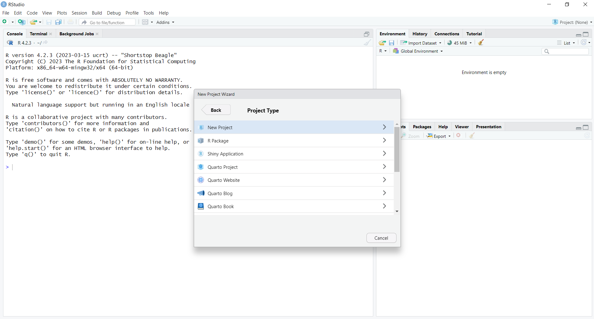
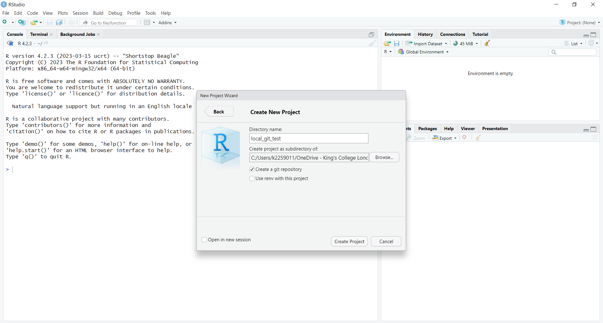
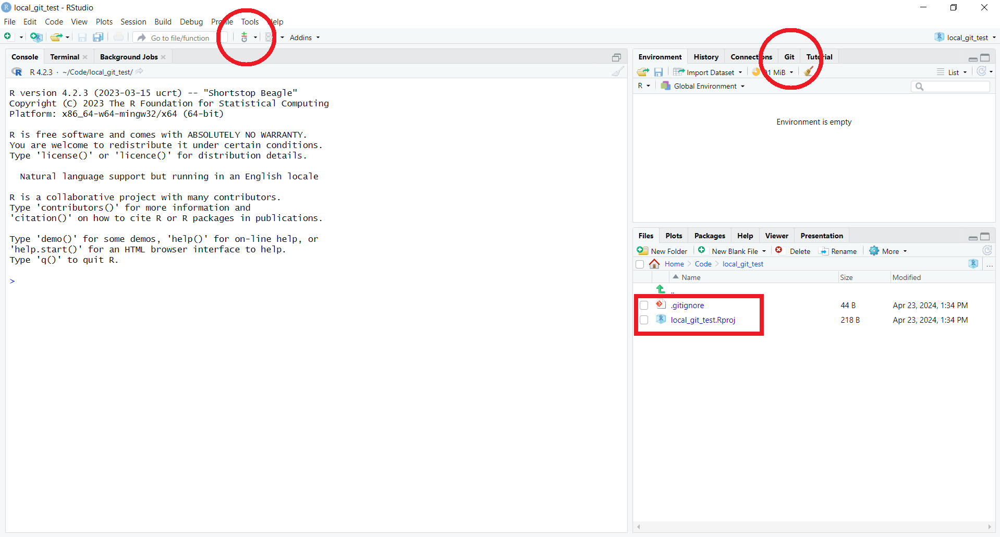
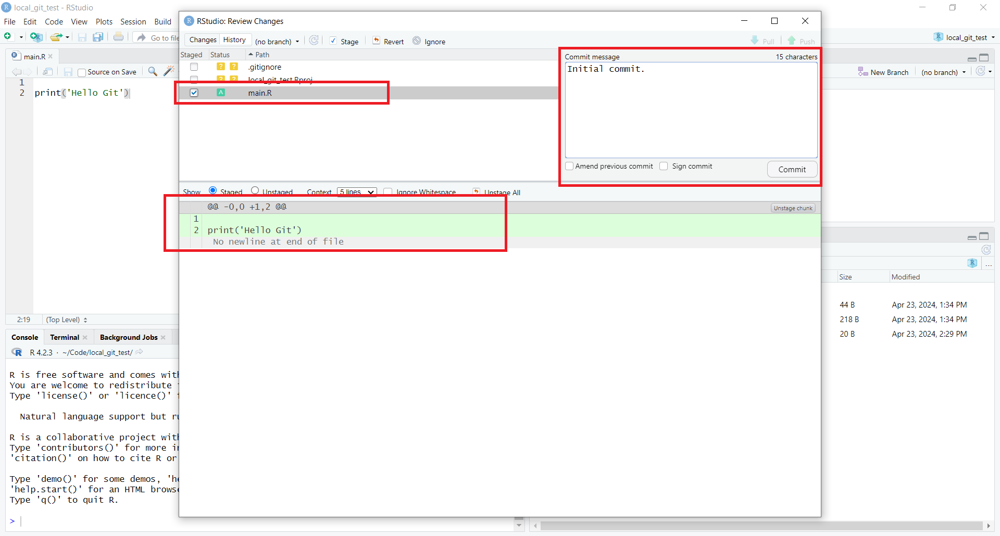
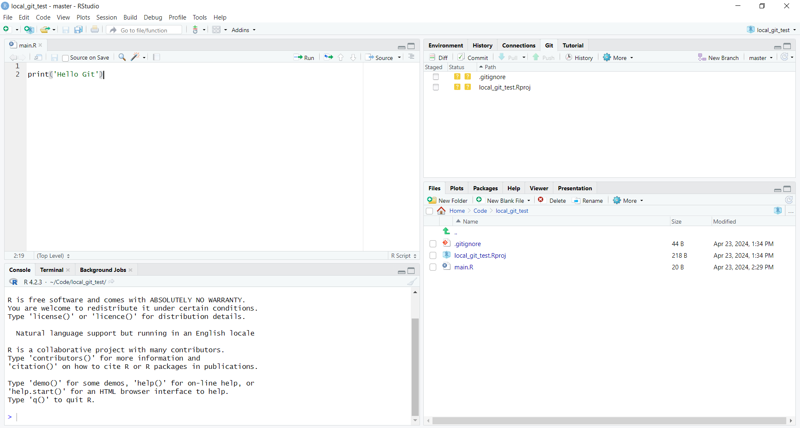
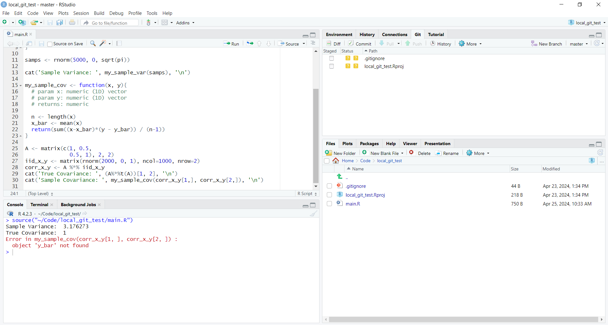
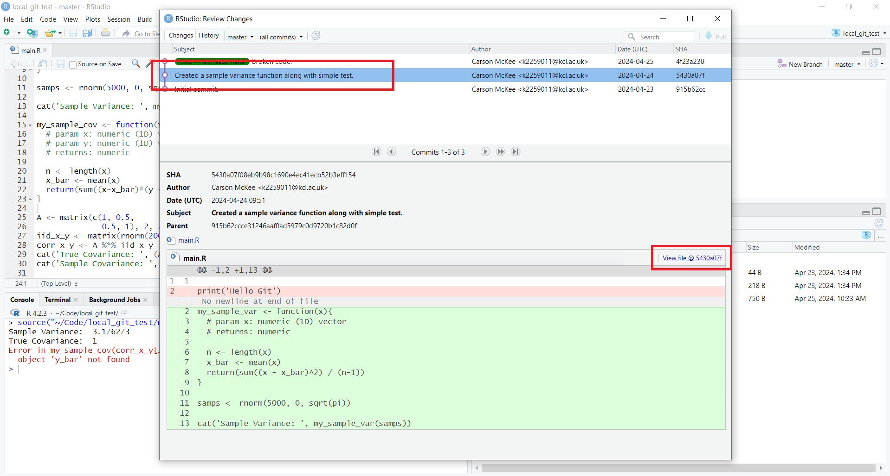
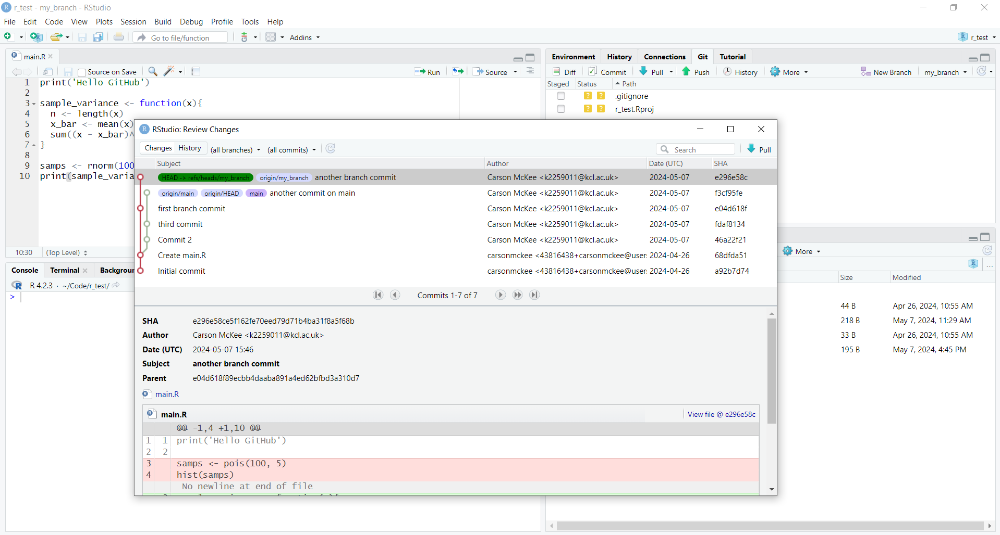
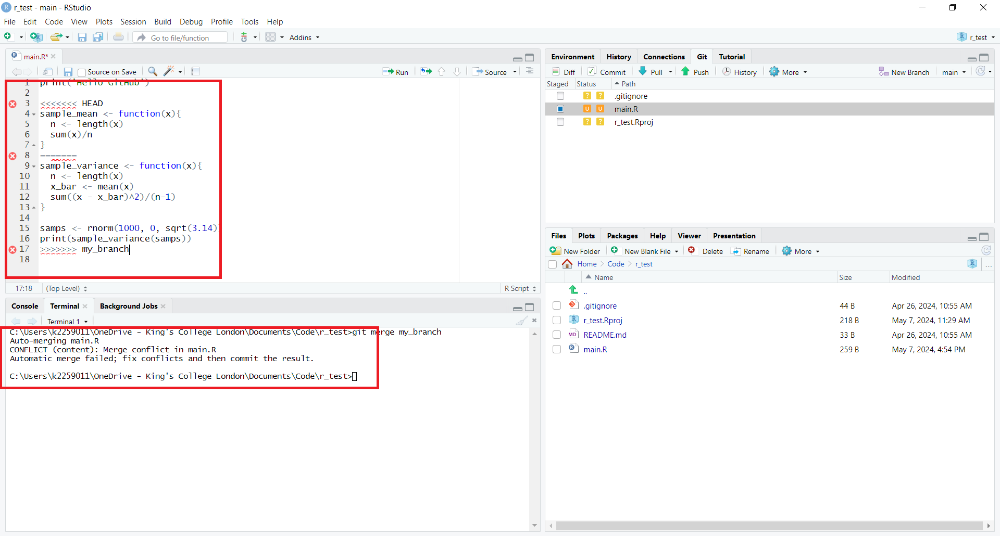
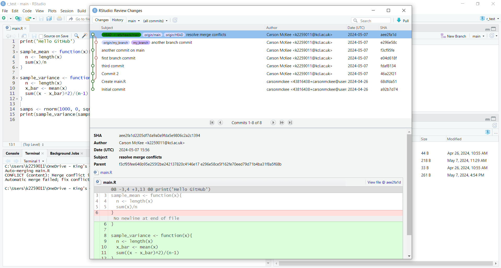

Creating a Local Git Repository with RStudio
================
Carson McKee
2024-04-22

Here we will look at how to create a local git repository (repo) and
connect it to an RStudio project. RStudio provides a nice GUI (Graphical
User Interface) for interacting with git. It is also possible to write
git commands directly into the terminal, however, here we will focus on
using the GUI.

# Installing Git

Before we can begin setting up a Git project you must first ensure that
Git (not GitHub!) is installed on your machine. This is fairly
straightforward, follow the OS specific installation instructions here:
<https://git-scm.com/downloads>. Then restart your RStudio session.

# Creating a Local Repo with RStudio

In order to create a local repo to manage our R files, we must create a
new RStudio project.

Navigate to the ‘File’ tab and select ‘New Project…’.  Then select ‘New Directory’.  Select ‘New Project…’
 Now choose a name for your git repo and tell
RStudio which directory to place it in. **Ensure you tick the ‘Create a
git repository’ box**.  After clicking ‘Create
Project’, RStudio will buffer before creating and opening the new
project/git repo. Once the new project has opened, you should see a few
new items displayed (marked in red below). We will come to these in the
next section. 

# Version Control with Git and RStudio

Now that we have created our local repo, we can start coding and use git
to manage our changes over time. Let’s start by creating a new file
named ‘main.R’ and printing some text.  Notice
that after creating and saving ‘main.R’, the file shows up in our file
manager (bottom right) and also in the ‘Git’ tab (top right). Next to
these files we see yellow icons with question marks. This indicates that
these files are new and we haven’t told git to track them yet.

## Commiting Files

If we want git to track versions of a file then we must ‘commit’ the
file. Each time we make a commit for a file, git creates and tracks a
new version of that file. Remember, commits should be:

- **Minimal**: A commit should only contain changes which relate to a
  single problem. Therefore, committing frequently is best.
- **Descriptive**: Always include a commit message/description. This
  should be concise, describe the change you made and the reason for it.

To commit ‘main.R’ we navigate to the git drop down menu and select
‘commit’.  This will open a ‘Review Changes’
box (shown below). On the top left, we see files available to commit.
After selecting ‘main.R’, the yellow bow should switch to green with an
‘A’ inside. This indicates that the file is ready to be
accepted/committed. On the top right will be a box where you can leave a
commit comment (which you should always do). In the bottom panel will be
a section of code highlighted either green (for code you have added) or
red (for code you have deleted). Finally, click ‘Commit’.
 After committing, you will see that ‘main.R’
has disappeared from the ‘Git’ tab on the top right.

## Modifying Files

Now let’s modify ‘main.R’ to contain some actual code. After saving the
changes you should see ‘main.R’ reappear in the ‘Git’ tab. It will have
a blue box with an ‘M’ inside, indicating that the file has now been
modified (see below).  After committing the
modified file, it will again disappear from the ‘Git’ tab. We have now
created a second version of ‘main.R’.

## Reverting Files

Occasionally we may try to modify our code and end up breaking it
completely. When not using git you might press ‘ctrl-z’ a bunch of times
to revert it back to its working state. However, this won’t work if
you’ve closed the editor/file. One of the big advantages to version
control is the ability to revert your files back to a previous working
version. Below I have added and committed some broken code to ‘main.R’.
 Now if we wish to undo these changes and go
back to a previous version of the file we first select ‘History’ in the
‘Git’ tab on the top right. This will open a box detailing all of your
commits. Now just navigate to the version you wish to revert to and
select ‘View file @ …’ (see below).  This will
open the file in a new window. Now just save the file under the same
name.  The code in your editor will now be
reverted to this version and you can recommit the corrected code.

## Ignoring Files

Sometimes we may have files which we do not want git to track. For
example, large unreadable data files or output files you are using to
test your code. In this case we can tell git to ‘ignore’ these files by
adding them to the ‘.gitignore’ file. In RStudio it is even easier as we
can just tick the file we want to ignore in the ‘Git’ panel and select
‘ignore’ (see below).  After clicking ignore,
RStudio will display a box showing the contents of ‘.gitignore’. After
saving and un-ticking the file it should disappear from the ‘Git’ panel
on the top right.

## Branching and Merging

Branching is used when you want to work on some new code which may be
quite unstable and break easily. Therefore, rather than commit this to
the master branch and risk breaking your existing code (which others may
be using), you can create a *branch*. Once the code on your branch is
finished and more stable, you can then *merge* it with the main branch
again. Although merging may require you to resolve conflicts in the
lines of code with the main branch.

Creating and switching between branches in RStudio is quite simple. To
create a branch, simply select ‘New Branch’ and enter your branch name.
If you are synced with GitHub (to be covered in the next worksheet), you
should also tick ‘Sync branch with remote’. 

This will create and switch you onto the new branch.You can switch
between the branches using the drop down menu next to ‘New Branch’.
After committing a few changes on each branch, you can check the
‘History’ tab and select all branches (see below).

Notice the master branch in red (main) and our new branch in green.
Although it may appear as though one branch is *ahead* of the other,
this is not the case, the branches evolve independently of each other.

However, you cannot remain on a branch forever. Branches should always
be temporary and as soon as it is safe to do so, you need to merge your
branch with the master branch. This is where the RStudio GUI falls
short - there is no button/option for merging. We must do this manually
using git commands in the terminal (don’t worry it’s quite simple). To
merge our new branch with the master branch:

1.  Ensure you are currently on the master branch (see top right below).
    Or in git talk, ensure the master branch is checked out.
2.  Switch from the R Console to the terminal (see bottom left below).
3.  In the terminal, enter the command ‘git merge branch_name’.

In my case, git has issued us an error message. The most up to date code
on the master branch is not in sync with the most up to date code on our
separate branch. We must manually resolve the code in ‘main.R’ and
recommit the changes on the master branch.

Once you have resolved and recommitted the changes, you should now see
that the branches have merged in the git history tab (see below).

